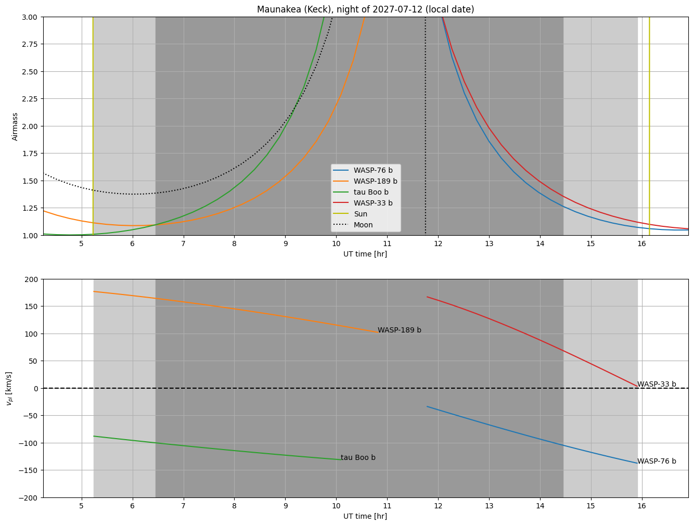
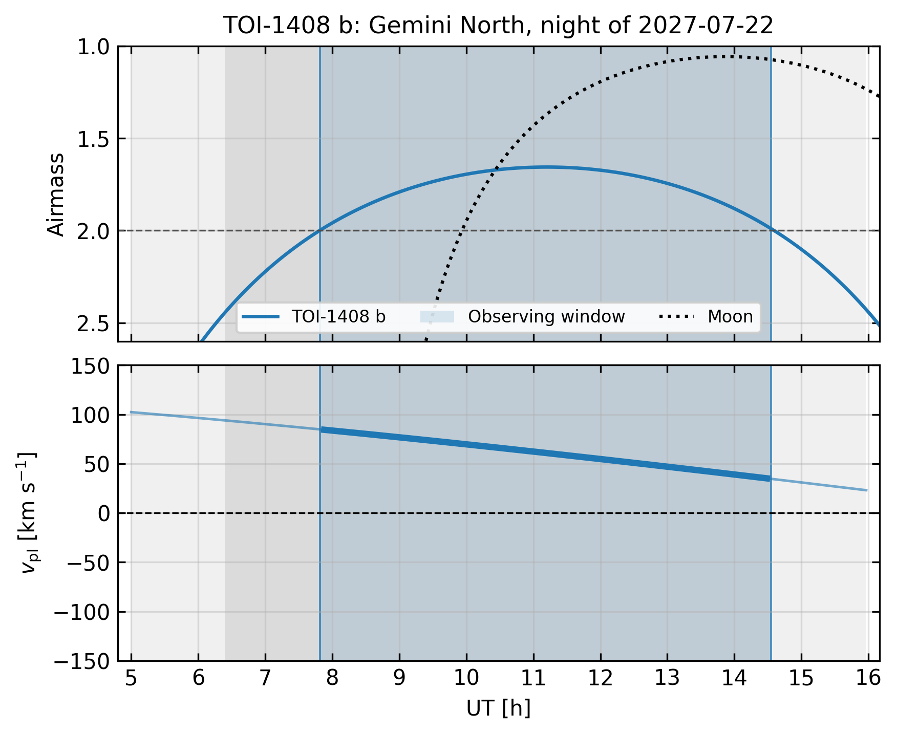

# Tutorial 1: your first night plan

In this tutorial you'll plot, for a week of nights at Maunakea, which planets in a target list
can be observed on their dayside, and when.

## 1. Create a workspace

```bash
hrccs-plan init ~/hrccs_work
export HRCCS_WORKSPACE=~/hrccs_work
```

```
Workspace: /home/you/hrccs_work
  copied example targetlists/examples_targetlist.csv
Use it with --workspace /home/you/hrccs_work, or: export HRCCS_WORKSPACE=/home/you/hrccs_work
```

`examples` is a list of nine well-known hot and ultra-hot Jupiters from the NASA Exoplanet
Archive: WASP-121 b, WASP-33 b, KELT-9 b, KELT-20 b, WASP-76 b, WASP-189 b, WASP-18 b,
HD 80606 b and τ Boo b. Open `~/hrccs_work/targetlists/examples_targetlist.csv` to see the
format, which is described in [the format reference](../targetlist_format.md).

## 2. Plot a week of nights

```bash
hrccs-plan nights examples --site keck --start 2027-07-10 --end 2027-07-16
```

```
Making plot for 2027-07-10 at MKO: WASP-76 b, KELT-20 b, WASP-189 b, WASP-33 b
Making plot for 2027-07-11 at MKO: KELT-9 b, WASP-33 b
Making plot for 2027-07-12 at MKO: WASP-76 b, WASP-189 b, tau Boo b, WASP-33 b
Making plot for 2027-07-13 at MKO: KELT-20 b
Making plot for 2027-07-14 at MKO: WASP-76 b, KELT-9 b
Making plot for 2027-07-15 at MKO: WASP-189 b, tau Boo b
Making plot for 2027-07-16 at MKO: KELT-20 b
7 plot(s) in /home/you/hrccs_work/plots
```

`--site` accepts a site, a telescope or an instrument name: `keck`, `gemini-n`, `magellan`,
`vlt`, `gemini-s`, and others. Run `hrccs-plan sites` for the full list. Any astropy site name
also works.

## 3. Read the plot



- **Top panel:** airmass versus UT. The Sun and Moon are drawn too. Light gray is between
  sunset and sunrise; dark gray is astronomical night (Sun below −18°).
- **Bottom panel:** each planet's velocity relative to its star, shown while the target is
  above 15°. A target appears only if:
  - it is above 30° for part of the night;
  - its velocity changes by more than 30 km/s while it is up;
  - its velocity is *decreasing*, which means the planet is on the far side of its orbit and
    its dayside faces us.

On this night, WASP-33 b passes through secondary eclipse (v = 0) just before sunrise, and
WASP-189 b and τ Boo b are observable early in the night.

## Options you'll use often

- `--date 2027-07-12`: a single night.
- `--require-conjunction`: only planets whose velocity crosses zero, i.e. secondary eclipse,
  during the night.
- `--inclination 30`: scales every Kp by sin i, for non-transiting planets. See
  [tutorial 4](04_nontransiting.md).
- `--outdir DIR`: write the plots somewhere other than `<workspace>/plots`.

## Shading the observing window, and a compact figure for proposals

`--shade CSV` shades the windows from a `hrccs-plan windows` or `hrccs-plan transits` CSV on
the matching nights and targets. A bare file name is looked up in
`<workspace>/output/best_windows/` and `output/transit_windows/`. `--window HH:MM-HH:MM` shades
a window you give by hand, in UT.

`--compact` makes a small figure (6.4 × 5.2 inches, 300 dpi) for proposals and papers:

- a shared UT axis covering the night only;
- airmass increasing downward, with the airmass-2 limit marked;
- the Moon drawn only above the horizon;
- each planet's velocity drawn thicker inside its window;
- transits, from a `transits` CSV, shaded darker than their baseline.

`--format pdf` writes a vector file, and `--title`/`--site-label` set the title.

```bash
hrccs-plan nights TOI-1408b --site gemini-n --date 2027-07-22 --inclination 82.4 \
    --shade best_windows_TOI-1408b_IGRINS_2027A_am.csv --compact --site-label "Gemini North" --format pdf
```



For a multi-planet system, `--show-all` plots every planet that is up (skipping the dayside and
velocity criteria). Planets of the same star share one airmass curve, labelled with the star
(`TOI-1408A`), and each planet gets its own velocity curve.

Targets with a shaded window on a night are always plotted, even if they would otherwise be
left out. This is needed for transits, which happen on the night side of the orbit.

Next, [tutorial 2](02_targetlists.md) shows how to build your own target list.
